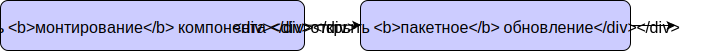

## Часть 1

[](https://rawgit.com/Bogdan-Lyashenko/Under-the-hood-ReactJS/master/stack/images/1/part-1.svg)

<em>1.0 Часть 1 (кликабельно)</em>

### Транзакции

Ну что ж, экземпляр компонента каким-то образом должен быть **связан** с экосистемой React'а и, конечно же, **как-то повлиять** на нее. Для этого выделен специальный модуль `ReactUpdates`. Как вам известно, **React применяет обновлениями чанками**, то есть он собирет несколько операций и выполняет их **вместе**. Это всегда лучше, потому что позволяет применить любые **предусловия** и **постусловия** только один раз для целого списка (чанка) обновлений элементов, вместо того чтобы применять их на каждое обновление по отдельности.

Что бы нам очень сильно помогло в подобной пре- и постобработке? Правильно, **транзакции**! Для кого-то это окажется новым термином или, по крайней мере, новой его интерпретацией в контексте использования в UI, так что давайте раскроем его чуть подробнее, и начнем мы с небольшого примера. 

Давайте представим себе `канал связи`: вам надо открыть соединение, отправить сообщение, затем закрыть соединение. Получается многовато, если вам надо отправить множество сообщений одно за другим. Вместо этого, можно  открыть соединение один раз, отправить все накопившиеся сообщения, и после этого закрыть соединение.


[](./images/1/communication-channel.svg)

<em>1.1 Очень правдоподобный пример транзакции (кликабельно)</em>

Хорошо, давайте теперь подумаем об этом с чуть более абстрактной точки зрения. Представьте, что `отправить сообщение` - это любая операция, которую вы хотите выполнить, а `открытие/закрытие соединения` это пре- и постобработка во время выполнения операции. А теперь представьте, что вы можете определять пары открыть-закрыть независимо, и использовать их с любыми методами, с которыми захотите (мы их можем назвать врапперами - обертками - потому что фактически каждая такая пара оборачивает методы с какими-то действиями). Здорово, правда?

Возвращаясь к React'у, транзакции - это паттерн, широко используемый внутри React'а. Помимо функции врапперов они также позволяют приложению сбрасывать поток транзакции, блокировать попытки конфликтующего совместного доступа, когда транзакция уже в процессе выполнения, а также множество других вещей. Поэтому есть много различных классов транзацкий, каждый из которых описывает специфичный сценарий - но все они наследуются от модуля `Transaction`. Ключевые различия между транзакциями заключены в списке врапперов этих конкретных транзакций. Врапперы же - это просто объекты, которые содержат методы инициализации и закрытия.

Таким образом, **основная идея в следующем**:
* вызвать каждый wrapper.initialize и закэшировать возвращаемое значение (его можно использовать позднее)
* вызвать метод самой транзакции
* вызвать каждый wrapper.close

[](https://rawgit.com/Bogdan-Lyashenko/Under-the-hood-ReactJS/master/stack/images/1/transaction.svg)

<em>1.2 Реализация транзакции (кликабельно)</em>


Давайте посмотрим на некоторые **другие сценарии использования** транзакций в React'е:
* Сохранять у input'ов области выделенного в них текста (selection ranges) до согласования и восставливать их после нее, даже в случае непредвиденной ошибки.
* Отключить события пока мы реорганизуем DOM, чтобы не бросались события blur и focus, гарантируя при этом что когда мы закончим система событий снова будет работать.
* Сбрасывать очередь накопившихся изменений DOM'а в основной UI-поток после того мы выполнили согласование в потоке worker'а
* Вызвать все накопившиеся методы `componentDidUpdate` после того как отрендерили новое содержимое.

Давайте теперь вернемся к нашему конкретному примеру.

Как вы видите, React использует `ReactDefaultBatchingStrategyTransaction` (1). Как мы только что разобрались, в транзакции самое главное - это ее врапперы, поэтому давайте взглянем на них и попытаемся понять, что же эта конкретная транзакция описывает. Заглянем в код:

```javascript
//\src\renderers\shared\stack\reconciler\ReactDefaultBatchingStrategy.js#L19
var RESET_BATCHED_UPDATES = {
	  initialize: emptyFunction,
	  close: function() {
		ReactDefaultBatchingStrategy.isBatchingUpdates = false;
	  },
};

var FLUSH_BATCHED_UPDATES = {
	 initialize: emptyFunction,
	 close: ReactUpdates.flushBatchedUpdates.bind(ReactUpdates),
}

var TRANSACTION_WRAPPERS = [FLUSH_BATCHED_UPDATES, RESET_BATCHED_UPDATES];
```
[Исходный код](https://github.com/facebook/react/blob/v15.4.2/src/renderers/shared/stack/reconciler/ReactDefaultBatchingStrategy.js#L19)

Для этой транзакции предусловий не определено - методы `initialize` у ее враппперов пустые, но один из метод `close` выглядит довольно интересно. Он вызывает `ReactUpdates.flushBatchedUpdates`. Что это значит? В действительности это означанает начало процесса верификации "грязных" компонентов с последующим ререндером. То есть смотрите, мы вызываем метод монтирования и оборачиваем его в эту конкретную транзакцию, потому что после монтирования React пойдет смотреть, какие вещи были затронуты примонтированным компонентом и обновляет их.

Теперь взглянем на метод, который был завернут в эту транзакцию - и он нас отсылает уже другой к транзакции...


### Хорошо, мы закончили *Часть 1*.

Давайте повторим, как мы сюда попали - глянем еще раз на схему, уберем из нее не очень важные куски, и она станет вот такой:

[](https://rawgit.com/Bogdan-Lyashenko/Under-the-hood-ReactJS/master/stack/images/1/part-1-A.svg)

<em>1.3 Часть 1 упрощенно (кликабельно)</em>

И наверное мы еще уберем пустое место и поправим выравнивание:

[](https://rawgit.com/Bogdan-Lyashenko/Under-the-hood-ReactJS/master/stack/images/1/part-1-B.svg)

<em>1.4 Часть 1 упрощенно после обработки (кликабельно)</em>

Замечательно. По сути, это все что произошло на данном этапе. Поэтому мы возьмем основные моменты *Части 1* и поместим их на итоговую схему процесса `монтирования`:

[](./images/1/part-1-C.svg)

<em>1.5 Часть 1 ключевые моменты (кликабельно)</em>

И мы закончили!


[На следующую страницу: Часть 2 >>](./Part-2.md)

[<< На предыдущую страницу: Часть 0](./Part-0.md)


[К оглавлению](./README.md)
