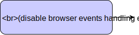

## Часть 2

[](https://rawgit.com/Bogdan-Lyashenko/Under-the-hood-ReactJS/master/stack/images/2/part-2.svg)

<em>2.0 Часть 2 (кликабельно)</em>

### И еще одна транзакция

На этот раз это будет `ReactReconcileTransaction`. Как вы уже знаете, самая важная и интересная часть в транзакции это ее впрапперы, у этой их три:

```javascript
//\src\renderers\dom\client\ReactReconcileTransaction.js#89
var TRANSACTION_WRAPPERS = [
  SELECTION_RESTORATION,
  EVENT_SUPPRESSION,
  ON_DOM_READY_QUEUEING,
];
```
[Исходный код](https://github.com/facebook/react/blob/v15.4.2/src/renderers/dom/client/ReactReconcileTransaction.js#L89)

Как мы видим, эти врапперы нужны в основном для того, чтобы **сохранять актуальное состояние**, блокируя определенные изменяемые значения перед вызовом метода, и разблокируя их после. Так, например, React гарантирует, что области выделеного текста (selection range) в текстовых input'ах не будут затронуты транзакцией (текущее значение сохранится в `initialize` и восстановится в `close`-методе враппера). Также React подавляет события (blur/focus), которые могут непреднамеренно инициироваться из-за высокоуровневых манипуляций DOM-деревом (например, временного удаления текстового input'а из DOM'а), путем **отключения `ReactBrowserEventEmitter`** в `initialize` и обратного включения в `close`.

И вот мы наконец приблизились к самому монтированию компонента, которое уже вернет нам готовую для вставки в DOM разметку. В действительности, `ReactReconciler.mountComponent` это просто обертка, или, правильнее будет сказать, "посредник" (`mediator`) - он делегирует метод монтирования в модули компонентов. Это важный момент, поэтому давайте его подчеркнем:

> Модуль `ReactReconciler` всегда вызывается в ситуациях, когда реализация какой-то логики **платформозависима**, как в нашем случае. Монтирование выглядит по-разному для разных платформ, поэтому `основной модуль` запрашивает `ReactReconciler`, а тот уже знает, что делать дальше.

Теперь о методе `mountComponent`. Про этот метод вы вероятно уже слышали - он инициализирует компонент, рендерит разметку и регистрирует слушатели событий. Как видите, после долгой подготовки мы наконец можем видить сам вызов монтирования компонента. После этого вызова мы уже должны получить фактические HTML-элементы, которые мы и вставим в документ.


### Хорошо, мы закончили *Часть 2*.

Давайте повторим, как мы сюда попали - глянем еще раз на схему, уберем из нее не очень важные куски, и она станет вот такой:

[](https://rawgit.com/Bogdan-Lyashenko/Under-the-hood-ReactJS/master/stack/images/2/part-2-A.svg)

<em>2.1 Часть 2 упрощенно (кликабельно)</em>

Уберем пустое место и поправим выравнивание:

[](https://rawgit.com/Bogdan-Lyashenko/Under-the-hood-ReactJS/master/stack/images/2/part-2-B.svg)

<em>2.2 Часть 2 упрощенно после обработки (кликабельно)</em>

Замечательно. По сути, это все что произошло на данном этапе. Поэтому мы возьмем основные моменты *Части 2* и поместим их на итоговую схему процесса `монтирования`:

[](./images/2/part-2-C.svg)

<em>2.3 Часть 2 основные моменты (кликабельно)</em>

И мы закончили!


[На следующую страницу: Часть 3 >>](./Part-3.md)

[<< На предыдущую страницу: Часть 1](./Part-1.md)


[К оглавлению](./README.md)
