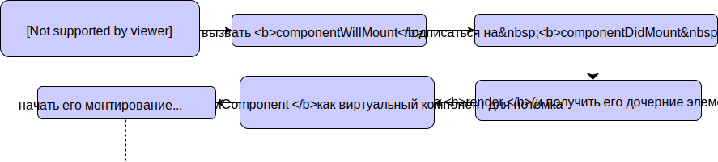

## Часть 3

[](https://rawgit.com/Bogdan-Lyashenko/Under-the-hood-ReactJS/master/stack/images/3/part-3.svg)

<em>3.0 Часть 3 (кликабельно)</em>

### Монтирование

Метод `componentMount` является одним из важнейших этапов на пути нашего знакомства с кодовой базой, поэтому давайте взглянем на интересующий нас `ReactCompositeComponent.mountComponent` (1).

Если вы помните, я упоминал, что **первым компонентом, который кладется в дерево компонентов** является `TopLevelWrapper` (внутренний React'овский класс). Здесь мы собираемся примонтировать его, хотя... по сути, это пустая обертка, для отладки не очень интересная. Учитывая, что поток выполнения на схеме от этого не поменяется, я предлагаю просто его пропустить и перейти сразу к дочернему компоненту.

На самом деле, монтирование дерева так и работает - сначала монтируется родитель, затем его дочерние компоненты, затем дочерние от дочерних компонентов, и так далее. Пока предлагаю поверить мне на слово - после монтирования `TopLevelWrapper` его дочерний компонент (`ReactCompositeComponent`, который управляет нашим компонентом `ExampleApplication`) пройдет через абсолютно аналогичную фазу.

Итак, давайте тогда сначала - мы снова находимся на шаге (1). Глянем, что внутри. Там будут происходить несколько ключевых вещей, поэтому давайте детально поговорим о логике происходящего.

### Назначаем модуль обновления экземпляра (updater)

Этот `updater` (2), возвращаемый из `transaction.getUpdateQueue()`, в действительности является модулем `ReactUpdateQueue`. Почему же тогда он **назначается здесь**? Потому что `ReactCompositeComponent` (класс, который мы сейчас рассматриваем) используется на всех платформах, а модули обновления будут разные, поэтому мы назначаем его динамически во время монтирования, в зависимости от платформы.

Хорошо. Прямо сейчас нам этот `updater` не нужен, но возьмем его на заметку. `updater` по-настоящему **важен**, совсем скоро он всплывет опять, когда мы будем говорить про хорошо всем известный метод **`setState`**.

В принципе, на этом этапе экземпляру компонента назначается не только `updater`, но и `props`, `context` и `refs`.

Давайте посмотрим на код ниже:

```javascript
// \src\renderers\shared\stack\reconciler\ReactCompositeComponent.js#255
// Эти присваивания должны быть в конструкторе, но для упрощения абстракции класса
// мы назначаем их уже после.
inst.props = publicProps;
inst.context = publicContext;
inst.refs = emptyObject;
inst.updater = updateQueue;
```
[Исходный код](https://github.com/facebook/react/blob/v15.4.2/src/renderers/shared/stack/reconciler/ReactCompositeComponent.js#L255)

Благодаря этому в вашем коде вы можете обращаться к `props` из экземпляра компонента через `this.props`.

### Создание экземпляра ExampleApplication

С помощью вызова `_constructComponent` (3) и пройдя через пару промежуточных конструкторов, мы наконец создаем `new ExampleApplication()`. Это то место, где будет вызван наш собственный конструктор, так что это первый раз, когда экосистема React'а наконец коснулась нашего кода. Неплохо.

### Выполняем первоначальное монтирование

Итак, мы проходим через монтирование (4) и первое, что тут должно произойти это вызов `componentWillMount` (если он конечно прописан в компоненте). Это первый метод жизненного цикла, с которым мы встретились. Чуть ниже мы также можем видеть `componentDidMount`, но он тут только кладется в очередь транзакций, поскольку он не должен вызываться напрямую - это произойдет в конце, когда операции монтирования закончатся. Также вы можете добавить вызов `setState` в `componentWillMount` - в этом случае состояние конечно пересчитается, но без вызова метода `render` (его нет смысла вызывать, раз компонент еще не примонтирован).

Официальная документация говорит то же самое:

> `componentWillMount()` вызывается непосредственно перед монтированием. Он вызывается перед `render()`, поэтому вызов setState() в этом методе не вызовет дополнительный ререндер.

Давайте-ка глянем в код и проверим, так ли это ;)

```javascript
// \src\renderers\shared\stack\reconciler\ReactCompositeComponent.js#476
if (inst.componentWillMount) {
    //..
    inst.componentWillMount();

    // Во время монтирования, вызовы `setState` методом `componentWillMount`
    // выставят `this._pendingStateQueue` не инициируя ререндер.
    if (this._pendingStateQueue) {
        inst.state = this._processPendingState(inst.props, inst.context);
    }
}
```
[Исходный код](https://github.com/facebook/react/blob/v15.4.2/src/renderers/shared/stack/reconciler/ReactCompositeComponent.js#L476)

Не соврали. Но когда `state` пересчитается, мы все-таки вызовем метод `render`, и да, это именно тот `render`, который мы сами написали в нашем компоненте, так что еще один контакт с нашим собственным кодом.

Хорошо, дальше мы создадим экземпляр React'овского компонента. Так, погодите-ка... Мы ведь уже видели этот вызов `this._instantiateReactComponent` (5), правильно? Да, но тогда мы создавали экземпляр `ReactCompositeComponent` для нашего компонента `ExampleApplication`. В этот раз мы собираемся создать экземпляры VDOM'а для его дочернего компонента, взяв за основу элемент, который наш компонент возвращает в методе `render`. В нашем конкретном случае метод рендера возвращает `div`, и ему в VDOM'е соответствует `ReactDOMComponent`. Когда экземпляр создан, мы опять вызываем `ReactReconciler.mountComponent`, но на этот раз в качестве `internalInstance` мы передаем только что созданный экземпляр `ReactDOMComponent`.

И теперь вызываем на нем `mountComponent`... 

### Хорошо, мы закончили *Часть 3*.

Давайте повторим, как мы сюда попали - глянем еще раз на схему, уберем из нее не очень важные куски, и она станет вот такой:

[](https://rawgit.com/Bogdan-Lyashenko/Under-the-hood-ReactJS/master/stack/images/3/part-3-A.svg)

<em>3.1 Часть 3 упрощенно (кликабельно)</em>

Уберем пустое место и поправим выравнивание:

[](https://rawgit.com/Bogdan-Lyashenko/Under-the-hood-ReactJS/master/stack/images/3/part-3-B.svg)

<em>3.2 Часть 3 упрощенно после обработки (кликабельно)</em>

Замечательно. По сути, это все что произошло на данном этапе. Поэтому мы возьмем основные моменты *Части 3* и поместим их на итоговую схему процесса `монтирования`:

[](./images/3/part-3-C.svg)

<em>3.3 Часть 3 основные моменты (кликабельно)</em>

И мы закончили!


[На следующую страницу: Часть 4 >>](./Part-4.md)

[<< На предыдущую страницу: Часть 2](./Part-2.md)


[К оглавлению](./README.md)
